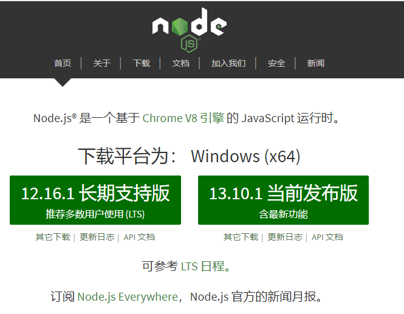

# 说明文档

请安装好 Node.js 环境

## 参考资料

基础：

- [ECMAScript 6 入门教程](https://es6.ruanyifeng.com)

  重点阅读前 10 章、Promise 与 async 和 Module 部分

- React
  - [React 中文文档](https://react.docschina.org)
    - [JSX](https://react.docschina.org/docs/introducing-jsx.html)
    - [Hooks](https://react.docschina.org/docs/hooks-intro.html)
- Typescript
  - [官方手册](https://www.typescriptlang.org/docs/home.html)
  - [使用 TypeScript 编写 React](https://github.com/typescript-cheatsheets/react-typescript-cheatsheet)
  - [中文文档](https://www.tslang.cn/docs/home.html)
- [Create React App](https://create-react-app.dev) 构建打包 React App 项目

常用到的库：

- [Ant Design](https://ant.design/docs/react/introduce-cn) 蚂蚁前端库
- [@umijs/hooks](https://hooks.umijs.org/zh-CN/hooks) 常用 hooks
- [zustand](https://github.com/react-spring/zustand) 状态管理
- [ical-generator](https://www.npmjs.com/package/ical-generator) 日历生成库
- [framer motion](https://www.framer.com/api/) 动效库
- [Fontawesome](https://fontawesome.com) 字体图标库

原理：

- [postMessage](https://developer.mozilla.org/zh-CN/docs/Web/API/Window/postMessage) 实现数据爬取的核心原生 API

部分链接建议魔法上网，学会适应阅读英文资料

## 配置坏境和进行开发

1. 在安装之前要确认你的机器上安装了[`node.js`](https://nodejs.org/zh-cn/)。如果没有安装，同学可以到 [`node.js`](https://nodejs.org/zh-cn/) 的官网下载自己电脑的对应的安装包来安装好环境。

   

2. 检测是否已安装好`node.js`，在命令行中输入

   ```bash
   npm -v
   ```

   

   如果有版本提示，则表明成功，若无可以考虑下要将`node.js`加入环境变量中

3. `clone`该项目

   ```bash
   git clone git@github.com:iscnu/scnu-schedule-ical-jwxt.git
   ```

4. 安装该项目所需要依赖

   `cd` 到该项目目录，执行

   ```
   npm install
   ```

   > 构建第一个 react 工程时会安装所需依赖，安装过程比较慢，
   > 大概率是因为`npm` 是从国外源下载依赖，我们 `npm`的源改成国内的 taobao 的源，
   > 这样速度就会有所改善。在安装依赖之前可以先修改一下 `npm` 的源：
   >
   > ```bash
   > npm config set registry https://registry.npm.taobao.org
   > ```

   执行后会自动安装 `package.json` 内的依赖,此过程有点慢，稍微等待

5. 启动项目

   ```bash
   npm start
   ```

   如果前面没出差错，等下会自动跳转到浏览器，此页面就是该项目主页面.

   

此外，我强烈推荐你安装 Prettier 这款 VSCode 格式化代码插件。

## 自己尝试开发 React App

1. 检查 `npx` 命令能不能用，不能用请输入 `npm install -g npx` 安装

2. 创建 `react` 工程，安装所需依赖

   下面这条命令会自动在我们的计算机上安装 `create-react-app` ，然后运行构建 `react` 模板项目

   ```bash
   npx create-react-app my-first-react-app # 带上 --typescript 是 typescript 语言
   ```

   此过程需要等待几分钟，最后提示`sucess`的话表明成功
