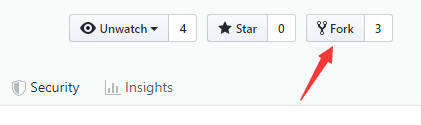
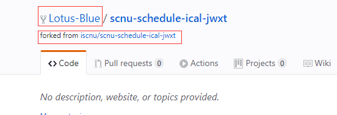
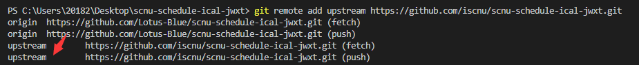
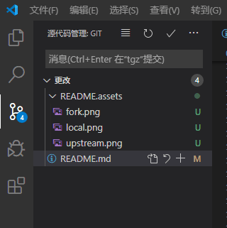
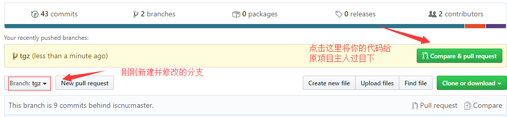
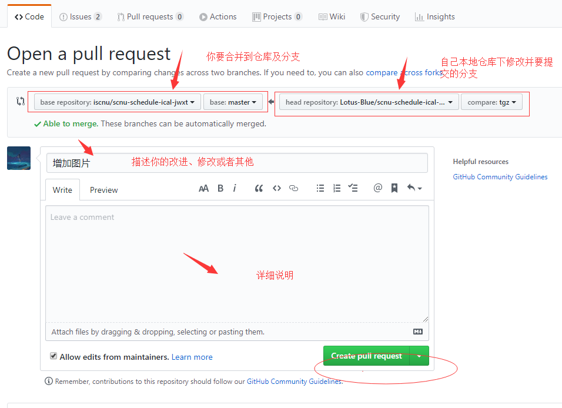
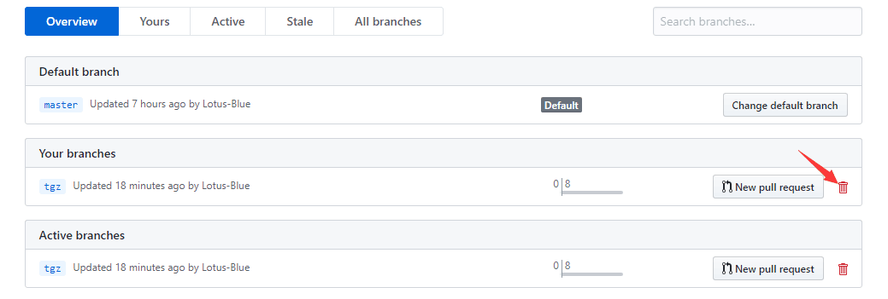

# 说明文档

请安装好 Node.js 环境

## 参考资料

基础：

- [ECMAScript 6 入门教程](https://es6.ruanyifeng.com)

  重点阅读前 10 章、Promise 与 async 和 Module 部分

- React
  - [React 中文文档](https://react.docschina.org)
    - [JSX](https://react.docschina.org/docs/introducing-jsx.html)
    - [Hooks](https://react.docschina.org/docs/hooks-intro.html)
- Typescript
  - [官方手册](https://www.typescriptlang.org/docs/home.html)
  - [使用 TypeScript 编写 React](https://github.com/typescript-cheatsheets/react-typescript-cheatsheet)
  - [中文文档](https://www.tslang.cn/docs/home.html)
- [Create React App](https://create-react-app.dev) 构建打包 React App 项目

常用到的库：

- [Ant Design](https://ant.design/docs/react/introduce-cn) 蚂蚁前端库
- [@umijs/hooks](https://hooks.umijs.org/zh-CN/hooks) 常用 hooks
- [zustand](https://github.com/react-spring/zustand) 状态管理
- [ical-generator](https://www.npmjs.com/package/ical-generator) 日历生成库
- [framer motion](https://www.framer.com/api/) 动效库
- [Fontawesome](https://fontawesome.com) 字体图标库

原理：

- [postMessage](https://developer.mozilla.org/zh-CN/docs/Web/API/Window/postMessage) 实现数据爬取的核心原生 API

部分链接建议魔法上网，学会适应阅读英文资料

## 配置坏境和进行开发

1. 在安装之前要确认你的机器上安装了[`node.js`](https://nodejs.org/zh-cn/)。如果没有安装，同学可以到 [`node.js`](https://nodejs.org/zh-cn/) 的官网下载自己电脑的对应的安装包来安装好环境。

   

2. 检测是否已安装好`node.js`，在命令行中输入

   ```bash
   npm -v
   ```

   

   如果有版本提示，则表明成功，若无可以考虑下要将`node.js`加入环境变量中

3. `clone`该项目

   ```bash
   git clone git@github.com:iscnu/scnu-schedule-ical-jwxt.git
   ```

4. 安装该项目所需要依赖

   `cd` 到该项目目录，执行

   ```
   npm install
   ```

   > 构建第一个 react 工程时会安装所需依赖，安装过程比较慢，
   > 大概率是因为`npm` 是从国外源下载依赖，我们 `npm`的源改成国内的 taobao 的源，
   > 这样速度就会有所改善。在安装依赖之前可以先修改一下 `npm` 的源：
   >
   > ```bash
   > npm config set registry https://registry.npm.taobao.org
   > ```

   执行后会自动安装 `package.json` 内的依赖,此过程有点慢，稍微等待

5. 启动项目

   ```bash
   npm start
   ```

   如果前面没出差错，等下会自动跳转到浏览器，此页面就是该项目主页面.

   

此外，我强烈推荐你安装 Prettier 这款 VSCode 格式化代码插件。

## 自己尝试开发 React App

1. 检查 `npx` 命令能不能用，不能用请输入 `npm install -g npx` 安装

2. 创建 `react` 工程，安装所需依赖

   下面这条命令会自动在我们的计算机上安装 `create-react-app` ，然后运行构建 `react` 模板项目

   ```bash
   npx create-react-app my-first-react-app # 带上 --typescript 是 typescript 语言
   ```

   此过程需要等待几分钟，最后提示`sucess`的话表明成功

# 贡献你的代码

在此之前，我们默认你目前满足以下情况:

- [x] 已经安装配置好上述所要求的环境以及自己成功跑通该项目

- [x] 已经装有`git`客户端以及拥有你自己的`github`账户
[`git`客户端安装教程](https://www.runoob.com/git/git-install-setup.html)以及[利用 SSH 完成 Git 与 GitHub 的绑定](https://blog.csdn.net/qq_35246620/article/details/69061355)

- [x] 熟悉基本的`git`操作(你起码要知道`add`是什么操作，`commit`是什么意思)
  
  附上:[git基本操作，一篇文章就够了！](https://juejin.im/post/5ae072906fb9a07a9e4ce596)  

然后我们开始快乐的~~搬砖过程~~（本过程以该项目为例）

1. 首先`fork`该项目到你的本地仓库

然后该项目会保存在你本地仓库中


2. 下一步，你需要`clone`刚刚从该项目`fork`过来的`scnu-schedule-ical-jwxt`到本地，通过在`git`客户端或者`vscode`控制窗口输入下面命令实现：

`git clone https://github.com/Lotus-Blue/scnu-schedule-ical-jwxt.git`
【不要复制，这里实际地址看你自己的本地的】

然后对应目录就会下载有该项目文件夹

3. 在你开始写任何代码之前，你需要创建一个新的`branch`.这个`branch`就是将来做`pull request`的时候作为`source branch`的。

在`git`客户端或者`vscode`控制窗口输入命令实现:

`git checkout -b feature_name`

这个`feature_name`是你自己起的名字，最好能起一个能表明你此时修改代码的意图,比如:

`git checkout -b fix_login_bug`

然后注意的是，没必要执行`checkout`命令了，因为

`git checkout -b fix_login_bug`等同于执行完下面两条指令：

`git branch fix_login_bug`（新建一个名为`fix_login_bug`的分支）

`git checkout fix_login_bug`（切换到该分支）


*PS*：最好创建一个新分支，各方面都方便点，而且之后从`master`进行`pull`操作也方便些.如果两个都是master，那么我们以后想更新`fork`过来的代码就需要这么做:【可能不理解为什么需要这么做，总之如果你新建了`branch`而不是直接在`master`上直接修改，下面几步可以不用看】

(1)首先要先确定一下是否建立了主repo的远程源：

`git remote -v`

(2)如果里面只能看到你自己`github`地址的两个源(`fetch` 和 `push`)，那就需要添加原始仓库的源地址：

`git remote add upstream https://github.com/iscnu/scnu-schedule-ical-jwxt.git`

(3)执行`git remote -v `你就可以看到`upstream`了



(4)获取原始主仓库最新数据:

`git fetch upstream` 

(5)合并仓库，更新本地代码

`git merge upstream/master`

如果新开一个`branch`，这样就不影响`fork`的那个branch继续从原始`git`地址进行`pull`更新

***所以我们强调要建一个新分支写你的代码***

4. 开始编写你的代码

在任何一款编辑器上编写你的代码，修改你想修改的地方。我比较喜欢用`vscode`，因为它提供了`git`操作方面的可视化。



`vscode`会检测任何变化，一有变化的话，源代码管理那里就会给出提示，具体操作可以百度，推荐一篇博文，[戳这里](https://zhuanlan.zhihu.com/p/34753075)。在这里只做`git`命令的展开。

5. 针对你修改的文件或者增加的每个文件，分别执行下面两条命令（这里我拿一个文件来举例子）

`git add README.md`

`git commit -m "增加git操作"`

6. 在每次`push`到自己本地仓库时，都应该检查下原始仓库`master`代码是否有更新，要保证我们的未修改部分与原始仓库`master`分支内容一致(可能其他成员已经成功提交了commit，而你还没更新)，否则到时`push`会发生错误。为了避免这种情况，所以不管团队成员是否已经改了远端仓库，都应执行下列动操作:

`git checkout master` (切换到master分支)

`git pull origin master` (拉取远端分支以获取最新内容,注意，这是创建了新分支情况下执行的，如果未创建新分支，会出错，处理情况前面有讲到)

`git checkout fix_login_bug`(切换到自己的分支)

`git merge master`（合并分支）

上面两句其实也可以一句执行完:

`git merge master fix_login_bug`

如果两端都有修改了相同地方的代码，那么在合并分支过程中会发生冲突，如果有冲突，需要手动解决冲突：

当你使用 `git status` 时， `git` 会告诉你存在一个 “未合并的路径（`unmerged paths`）”，这只是用另外一个方式告诉你，存在一个或多个冲突：(告诉我们冲突的文件,比如冲突文件为`README.md`)

然后

(1)`git`客户端打开该冲突文件，根据提示修改冲突部分【大部是因为不同成员在不同分支修改了同位置的代码，做出取舍就好】

(2)`git add README.md`

(3)`git commit -m "conflict fixed"`


7. 解决冲突后，提交修改到本地仓库

`git push origin fix_login_bug`

8. 开始`Pull Requst`

第7步成功之后，回到你`github`本地仓库，可以看到



(上面的仓库名与这里的仓库名不同，请忽略，上面是为了举例子，实际操作时我是起这个的)

9. 添加一些额外信息，确认提交
    

10. 原仓库作者以及协作者将会收到邮箱提醒，若你提的是对的，就可以 `merge`到原仓库的`master`分支，合并到原项目中

11. 成功commit的话，进行下部操作:
    
    点击`github`菜单栏的`branches`,删除仓库分支,留着没用了，原仓库`master`是最新的。如果有强迫症，可以不用删除，保留着。



12. 删除本地分支
`git branch -d fix_login_bug`

13. 重新`git pull origin master` 获取远端原仓库`master`分支最新内容，然后在本地新建分支，修改，提交，拉请求....

***一千个轮回***